# 💱 Currency Exchange Rate Forecasting

> A comprehensive end-to-end forecasting system for SGD/USD and CNY/USD exchange rates using statistical, machine learning, deep learning, and ensemble methods.

---

## 🛠️ Technologies


---

## 📌 Project Overview

This project builds a **production-grade currency exchange rate forecasting system** for **SGD/USD** (Singapore Dollar) and **CNY/USD** (Chinese Yuan) across **4 Jupyter notebooks** and **12 models** spanning four methodological families.

The pipeline covers everything from raw data ingestion, exploratory analysis, and feature engineering through model training, evaluation, and business recommendations — with **37 saved visualisations** and a full comparative analysis across all model families.

> 🏆 **Best Result:** Weighted Ensemble — **RMSE 0.003472** for SGD/USD and **R² 0.9861** for CNY/USD

---

## 📁 Project Structure

```
currency-forecasting/
│
├── data/
│   └── Foreign_Exchange_Rates.csv           # Raw dataset — 5,217 daily observations
│
├── notebooks/
│   ├── 01_eda_statistical_models.ipynb      # EDA + 8 statistical models
│   ├── 02_ml_models.ipynb                   # 5 machine learning models
│   ├── 03_deep_learning.ipynb               # 3 deep learning models
│   └── 04_hybrid_ensemble.ipynb             # Ensemble methods + final comparison
│
├── reports/                                 # 37 saved visualisations
│
└── README.md
```

---

## 📊 Dataset

| Property | Detail |
|---|---|
| **Source** | Federal Reserve Foreign Exchange Rates |
| **Period** | January 2000 — December 2019 |
| **Frequency** | Daily |
| **Total Observations** | 5,217 rows |
| **Currencies** | SGD/USD, CNY/USD |
| **Missing Values** | 198 SGD, 197 CNY (forward filled) |
| **Train Split** | 80% → 2000-01-03 to 2015-12-30 |
| **Test Split** | 20% → 2015-12-31 to 2019-12-31 |

---

## 📓 Notebook 01 — Exploratory Data Analysis & Statistical Models

### Exploratory Data Analysis

A thorough EDA was conducted to understand the structure, distribution, and temporal behaviour of both exchange rate series before any modelling.

**Raw Exchange Rates (2000–2019)**

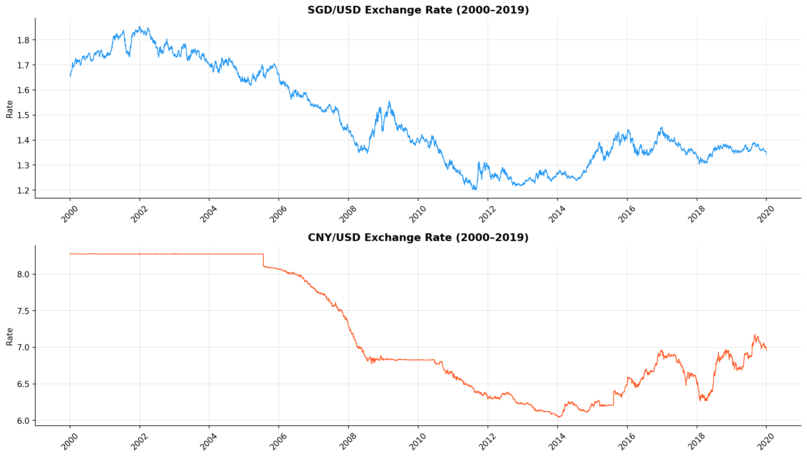

SGD/USD declined from ~1.72 in 2000 to ~1.35 in 2019. CNY/USD declined sharply from ~8.28 (fixed peg) to ~6.50 after China's 2005 revaluation, then further to ~7.00 by 2019.

---

**Rolling Statistics & Volatility**

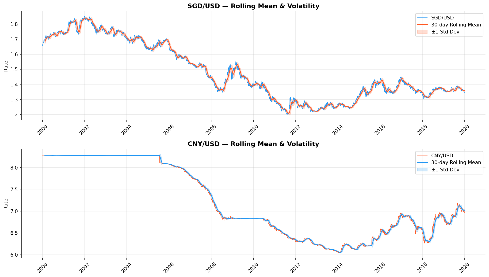

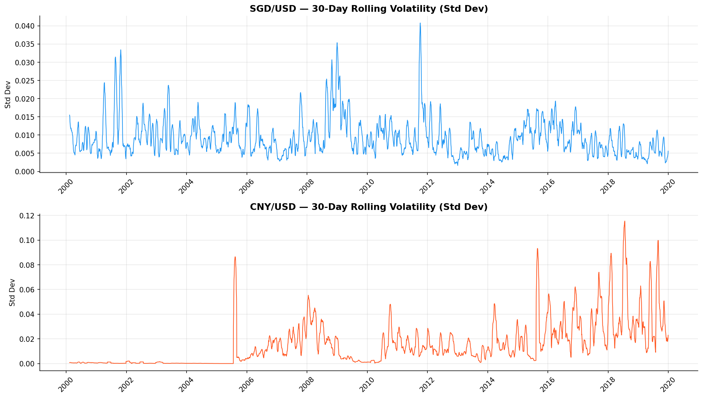

Volatility clustering is clearly visible — periods of high volatility (2008 GFC, 2015 CNY devaluation) cluster together. This directly motivated the inclusion of rolling standard deviation as a feature in ML models.

---

**Correlation Heatmap**

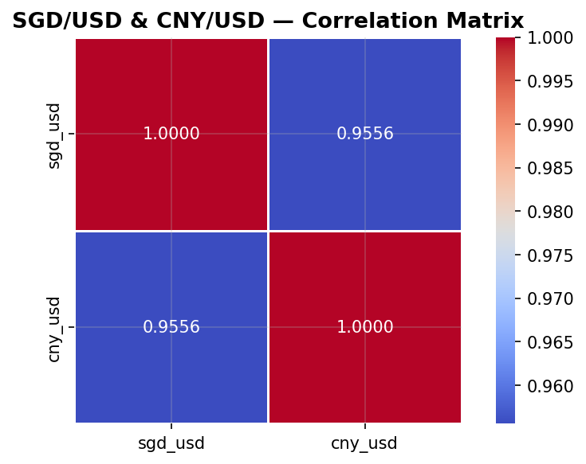

SGD/USD and CNY/USD exhibit **95.6% correlation** — a critical EDA finding that motivated cross-currency features in ML models and the VECM cointegration model.

---

**Seasonal Decomposition**

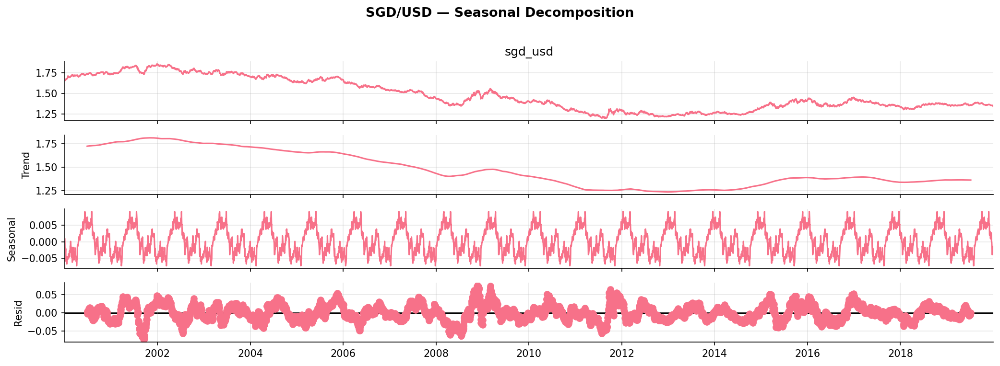

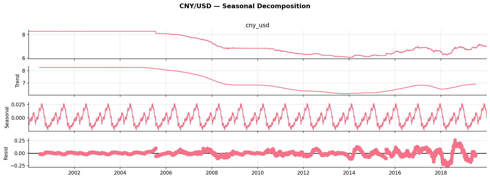

---

**Distribution & Annual Boxplots**

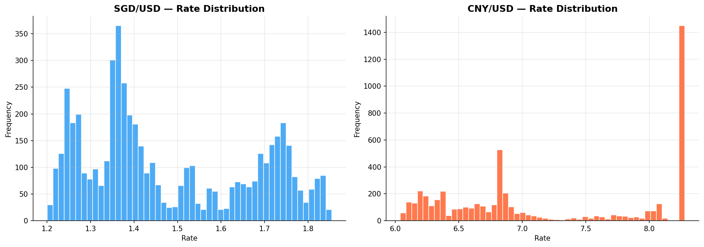

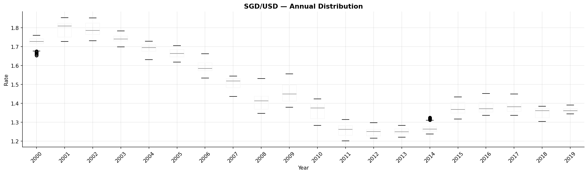

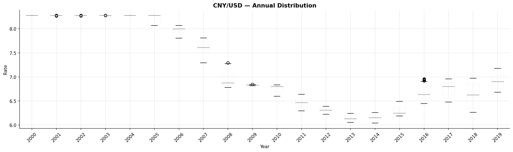

---

**ACF / PACF Analysis**

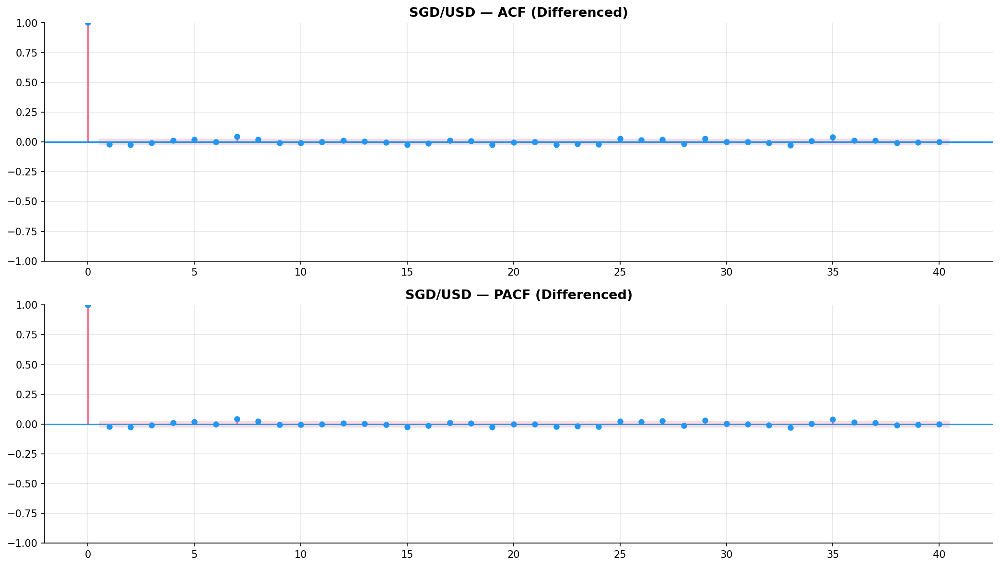

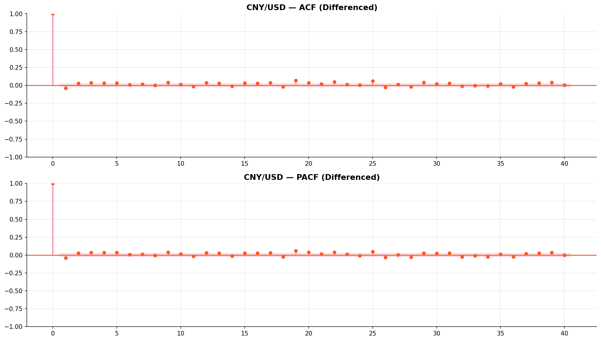

Significant PACF lags at 1, 2, 3 days directly informed the lag feature selection for all ML models.

---

**Train / Test Split**

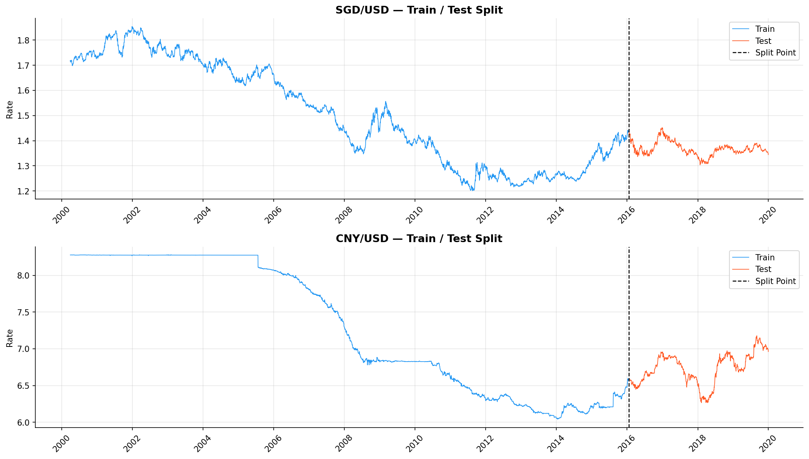

---

### Statistical Models

Eight classical statistical models were implemented and evaluated:

| Model | SGD RMSE | SGD R² | SGD DA% | CNY R² | CNY DA% |
|---|---|---|---|---|---|
| Naïve Random Walk | 0.004057 | 0.9784 | 46.74% | 0.9942 | 43.15% |
| Holt-Winters | 0.053092 | -2.6756 | 48.93% | -26.90 | 45.24% |
| ARIMA | 0.077579 | -6.8481 | 4.95% | -0.2969 | 26.60% |
| SARIMA | 0.077661 | -6.8646 | 8.35% | -0.2419 | 30.00% |
| **SARIMAX** | 0.089232 | -9.3828 | **67.28%** | -0.5437 | **66.80%** |
| VAR | 0.047752 | -1.9735 | 50.00% | -3.7684 | 44.56% |
| VECM | 0.086406 | -8.7356 | 45.05% | 0.0393 | 45.15% |
| Prophet | 0.158141 | -31.611 | 48.54% | -2.5821 | 48.64% |

**Key finding:** The Naïve baseline outperforms all statistical models on RMSE. SARIMAX achieves the best directional accuracy (67%) by incorporating CNY as an exogenous variable.

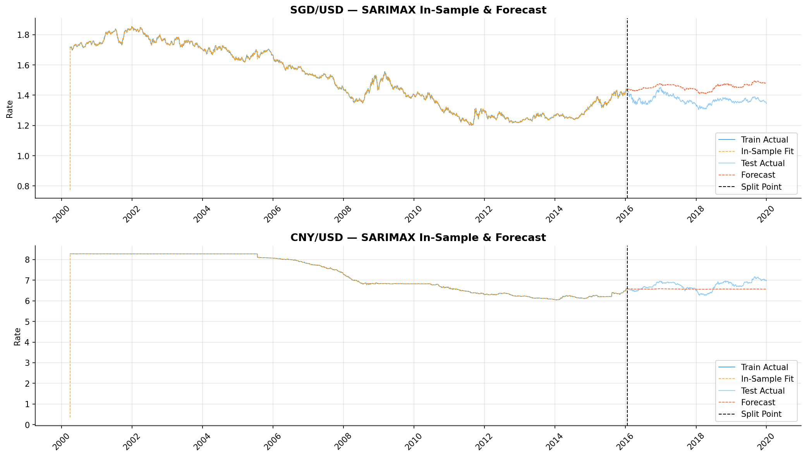

---

## 📓 Notebook 02 — Machine Learning Models

### Feature Engineering

**34 features** were engineered from raw rates, each motivated by EDA findings:

| Category | Features | Count | Motivation |
|---|---|---|---|
| **Lag features** | `sgd/cny_lag_1,2,3,5,10,21` | 12 | ACF/PACF significant lags |
| **Rolling statistics** | Mean + Std for 7, 21, 63 days × 2 currencies | 12 | Volatility clustering |
| **Momentum (ROC)** | `pct_change(7)` and `pct_change(21)` × 2 currencies | 4 | Trend persistence |
| **Calendar** | Day of week, month, quarter, year | 4 | Seasonal decomposition patterns |
| **Cross-currency** | SGD/CNY ratio and spread | 2 | 95.6% inter-currency correlation |

All features scaled to [0, 1] using `MinMaxScaler` — fit on training data only to prevent data leakage.

---

### Machine Learning Results

| Model | SGD RMSE | SGD R² | SGD DA% | CNY RMSE | CNY R² | CNY DA% |
|---|---|---|---|---|---|---|
| Decision Tree | 0.007745 | 0.9218 | 11.17% | 0.043628 | 0.9571 | 13.88% |
| Random Forest | 0.005260 | 0.9639 | 37.48% | 0.044174 | 0.9561 | 36.89% |
| SVR (RBF) | 0.017491 | 0.6010 | **68.06%** | 0.041016 | 0.9621 | **67.28%** |
| XGBoost | **0.003743** | **0.9817** | 59.42% | 0.032156 | 0.9767 | 55.63% |
| LightGBM | 0.003717 | **0.9820** | 58.35% | **0.031128** | **0.9782** | 57.48% |

**Decision Tree Forecast**

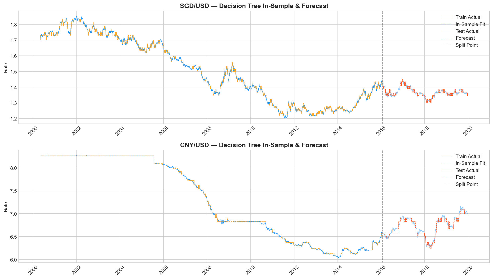

**Random Forest Forecast**

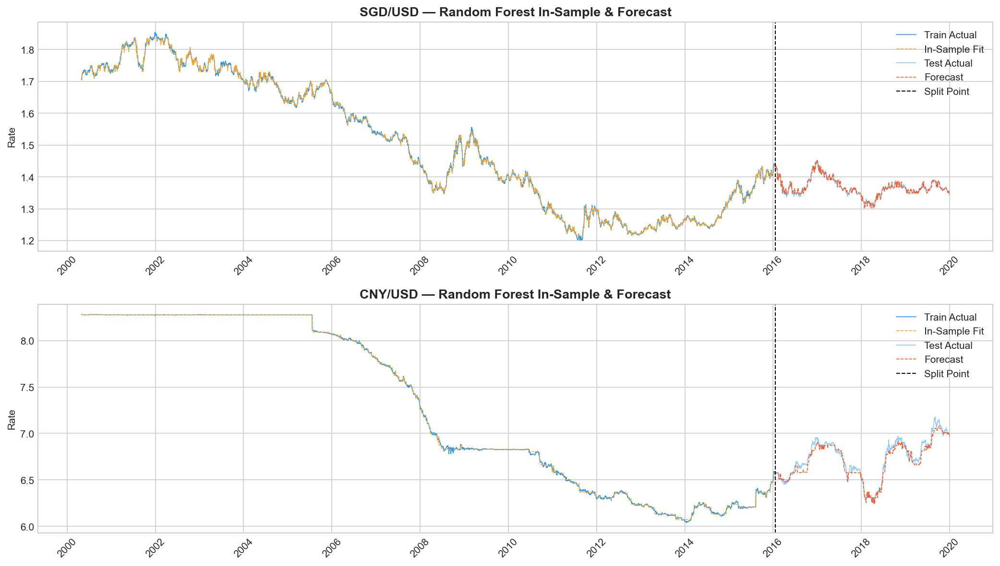

**SVR Forecast**

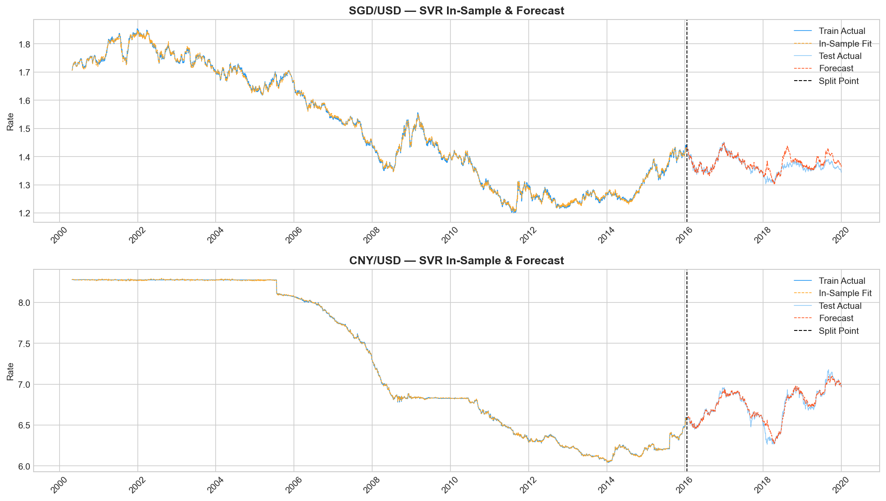

**XGBoost Forecast**

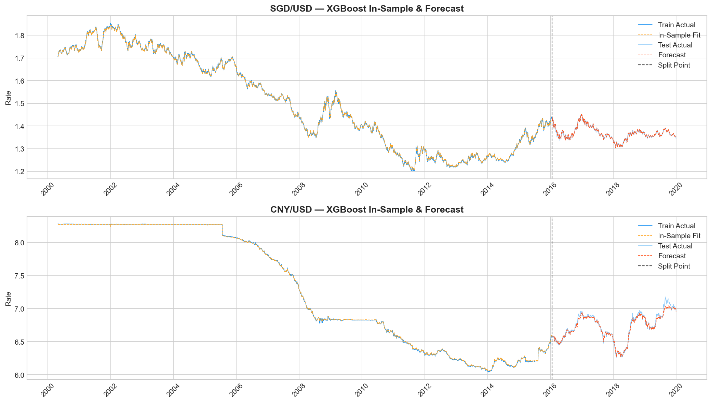

**LightGBM Forecast**

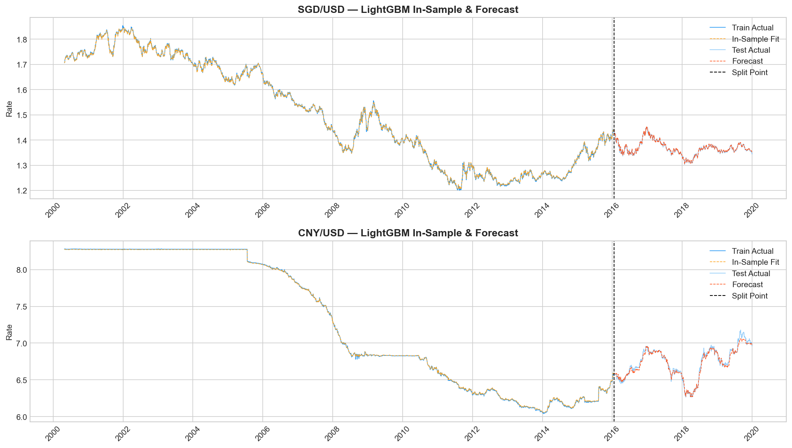

**Key findings:**
- XGBoost and LightGBM achieve the best level prediction — R² above 0.98 for SGD
- SVR (RBF kernel) achieves the best directional accuracy (68%) across all individual models
- Decision Tree produces a staircase pattern — can only output values seen during training
- Gradient boosting models significantly outperform all statistical models on level prediction

---

## 📓 Notebook 03 — Deep Learning Models

### Sequence Architecture

All models take **60 consecutive days** as input and predict the next day's rate. Data scaled with `MinMaxScaler`, predictions inverse-transformed for evaluation.

```
Input shape  →  (samples, 60 timesteps, 1 feature)
Output shape →  (samples, 1)  ←  next day's rate
```

---

### LSTM — Long Short-Term Memory

```
Architecture : LSTM(64) → Dropout(0.2) → LSTM(32) → Dropout(0.2) → Dense(1)
Parameters   : 29,345
```

Three gates — forget, input, output — enable the model to learn long-term dependencies across the 60-day window.

**Training History**

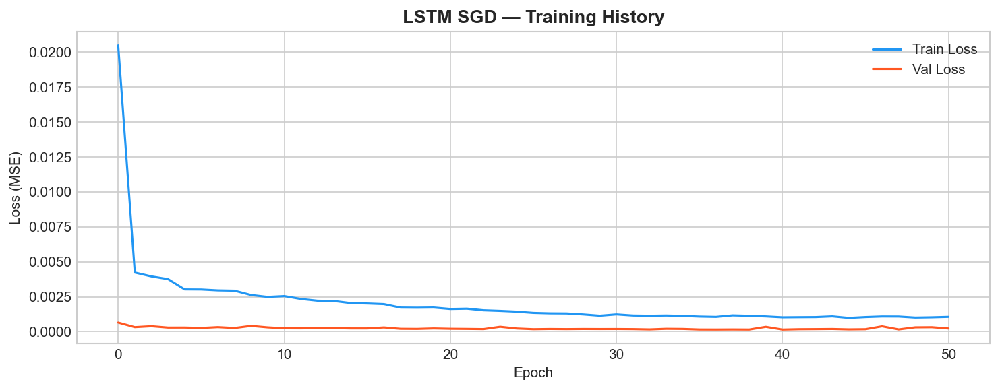

**Forecast**

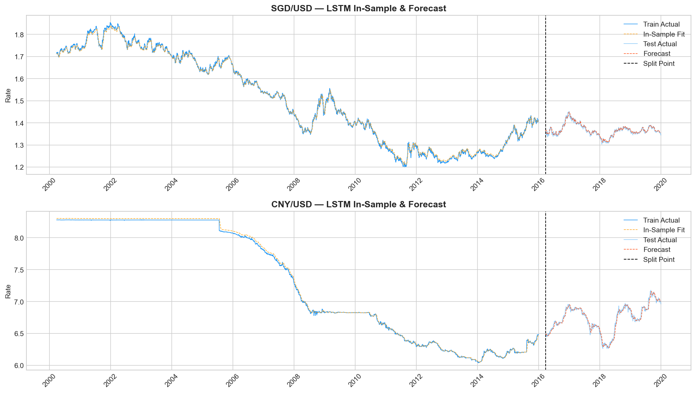

---

### GRU — Gated Recurrent Unit

```
Architecture : GRU(64) → Dropout(0.2) → GRU(32) → Dropout(0.2) → Dense(1)
Parameters   : 22,305  (24% fewer than LSTM)
```

Simplified LSTM with two gates — reset and update. Faster training with comparable or better performance.

**Training History**

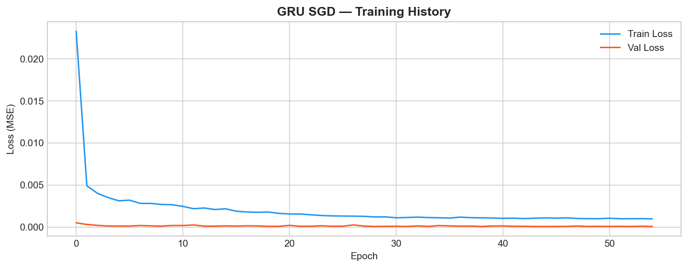

**Forecast**

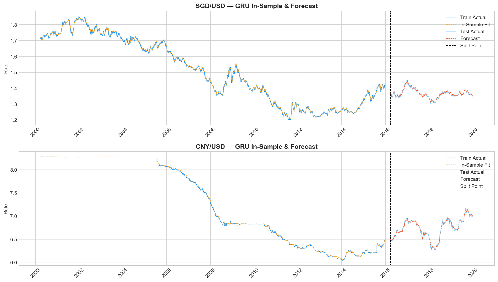

---

### Transformer

```
Architecture : Input → Dense(32) → MultiHeadAttention(heads=4, key_dim=8)
               → LayerNorm → FeedForward(64) → LayerNorm
               → GlobalAvgPool → Dense(32) → Dense(1)
Parameters   : 9,697
```

Self-attention mechanism processes the entire sequence simultaneously, learning which past days are most relevant for the next-day prediction.

**Forecast**

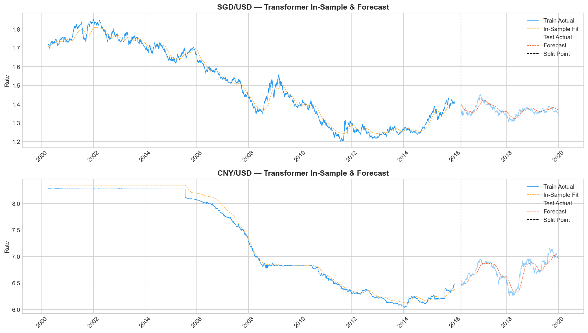

---

### Deep Learning Results

| Model | SGD RMSE | SGD R² | SGD DA% | CNY RMSE | CNY R² | CNY DA% |
|---|---|---|---|---|---|---|
| LSTM | 0.006301 | 0.9456 | 47.10% | 0.035658 | 0.9715 | 45.07% |
| **GRU** | **0.004693** | **0.9698** | **50.56%** | **0.022967** | **0.9882** | 44.46% |
| Transformer | 0.016963 | 0.6059 | 49.85% | 0.103100 | 0.7619 | 45.57% |

**Key findings:**
- GRU outperforms LSTM on all metrics despite 24% fewer parameters
- GRU achieves the best CNY R² (0.9882) across all model families
- Transformer underperforms — insufficient data volume for attention to generalise effectively
- GRU is the only deep learning model to exceed 50% directional accuracy

---

## 📓 Notebook 04 — Hybrid & Ensemble Models

### Strategy

Three base models were combined — XGBoost, LightGBM and GRU — chosen for complementary strengths:

- **XGBoost / LightGBM** — best level prediction, engineered tabular features
- **GRU** — best temporal pattern learning, raw sequence modelling

**Simple Ensemble:** `Final = (XGBoost + LightGBM + GRU) / 3`

**Weighted Ensemble:** Weights inversely proportional to each model's test RMSE

| Model | SGD Weight | CNY Weight |
|---|---|---|
| XGBoost | 0.357 | 0.291 |
| LightGBM | 0.359 | 0.301 |
| GRU | 0.284 | **0.408** |

GRU receives the highest weight for CNY — reflecting its superior CNY performance.

---

### Ensemble Forecast

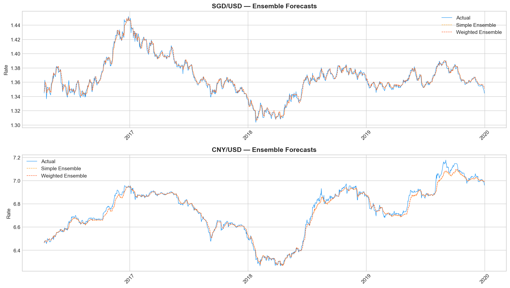

---

### Ensemble Results

| Metric | SGD Simple | SGD Weighted | CNY Simple | CNY Weighted |
|---|---|---|---|---|
| **RMSE** | 0.003519 | **0.003472** | 0.025937 | **0.024859** |
| **R²** | 0.9832 | **0.9836** | 0.9848 | **0.9861** |
| **DA%** | 57.01% | **57.94%** | **56.19%** | 54.43% |

---

## 🏆 Final Model Comparison — All 12 Models

### SGD/USD Rankings

| Rank | Model | RMSE | R² | DA% |
|---|---|---|---|---|
| 🥇 | **Weighted Ensemble** | **0.003472** | **0.9836** | 57.94% |
| 🥈 | Simple Ensemble | 0.003519 | 0.9832 | 57.01% |
| 🥉 | LightGBM | 0.003717 | 0.9820 | 58.35% |
| 4 | XGBoost | 0.003743 | 0.9817 | 59.42% |
| 5 | Naïve | 0.004057 | 0.9784 | 46.74% |
| 6 | GRU | 0.004693 | 0.9698 | 50.56% |
| 7 | Random Forest | 0.005260 | 0.9639 | 37.48% |
| 8 | LSTM | 0.006301 | 0.9456 | 47.10% |
| 9 | Decision Tree | 0.007745 | 0.9218 | 11.17% |
| 10 | Transformer | 0.016963 | 0.6059 | 49.85% |
| 11 | SVR | 0.017491 | 0.6010 | **68.06%** |
| 12 | Prophet | 0.158141 | -31.611 | 48.54% |

### CNY/USD Rankings

| Rank | Model | RMSE | R² | DA% |
|---|---|---|---|---|
| 🥇 | **Weighted Ensemble** | **0.024859** | **0.9861** | 54.43% |
| 🥈 | GRU | 0.022967 | 0.9882 | 44.46% |
| 🥉 | Simple Ensemble | 0.025937 | 0.9848 | 56.19% |
| 4 | LightGBM | 0.031128 | 0.9782 | 57.48% |
| 5 | XGBoost | 0.032156 | 0.9767 | 55.63% |
| 6 | LSTM | 0.035658 | 0.9715 | 45.07% |
| 7 | SVR | 0.041016 | 0.9621 | **67.28%** |
| 8 | Decision Tree | 0.043628 | 0.9571 | 13.88% |
| 9 | Random Forest | 0.044174 | 0.9561 | 36.89% |
| 10 | Naïve | 0.006548 | 0.9942 | 43.15% |
| 11 | Transformer | 0.103100 | 0.7619 | 45.57% |
| 12 | Prophet | — | -2.5821 | 48.64% |

---

## 💼 Business Recommendations

### Recommended Deployment: Weighted Ensemble

- **Daily rate setting** — RMSE of 0.003472 provides tight confidence intervals for SGD pricing decisions
- **Risk management** — directional accuracy of 57.94% provides a marginal edge for hedging strategies
- **CNY-specific decisions** — GRU component dominates CNY predictions and receives highest weight automatically

### Limitations

- Models trained on 2000–2019 data — performance may degrade during unprecedented macro events
- Directional accuracy of ~57% is insufficient for fully automated trading without additional risk controls
- Macroeconomic indicators (interest rates, inflation, GDP) not incorporated

### Next Steps

1. Retrain models annually with updated market data
2. Add macroeconomic exogenous variables (interest rate differentials, inflation)
3. Implement walk-forward cross-validation for more robust evaluation
4. Build a real-time Streamlit dashboard for stakeholder visibility
5. Explore regime-switching models for high/low volatility periods

---

## ⚙️ Setup & Installation

```bash
# Clone the repository
git clone https://github.com/Akakinad/currency-forecasting.git
cd currency-forecasting

# Create virtual environment with uv
uv venv
source .venv/bin/activate  # macOS/Linux

# Install dependencies
uv pip install pandas numpy matplotlib seaborn statsmodels prophet
uv pip install scikit-learn xgboost lightgbm tensorflow jupyter
```

---

## ▶️ Running the Notebooks

Run in order — each notebook builds on the previous:

```bash
jupyter notebook notebooks/01_eda_statistical_models.ipynb
jupyter notebook notebooks/02_ml_models.ipynb
jupyter notebook notebooks/03_deep_learning.ipynb
jupyter notebook notebooks/04_hybrid_ensemble.ipynb
```

---

## 👤 Author

**Akakinad**

[](https://github.com/Akakinad)

---

## 📄 License

This project is licensed under the MIT License.
